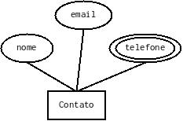

# Desafio Backend Novaweb

Este desafio é parte do processo seletivo para a vaga "Desenvolvedor backend" da empresa Novaweb.

## Instruções

1. Implementar a solução para o problema utilizando .NET, incluindo ao menos uma carga de trabalho do github actions que publica uma imagem docker no github packages do seu repositório;

## Descrição do problema

Neste desafio, você deverá implementar uma API de contatos que inclua o nome da contato, um email e múltiplos telefones. Sua solução deve implementar o modelo entidade relacionamento abaixo, pelo menos.

### Requisitos

Para este desafio você deverá usar um banco de dados PostgreSQL. Sugerimos que utilize para testes o serviço [ElephantSQL](elephantsql.com), que disponibiliza um banco de dados gratuito na cloud. A configuração do seu banco de dados deverá ser feito via variáveis de ambiente do contêiner.

Você deverá disponibilizar uma documentação da API pública. Sugerimos que utilize uma collection do Postman ou do Insomnia.

## Avaliação

Serão avaliados os seguintes critérios:

 * Se o seu código está bem escrito de acordo com o Clean Code
 * A utilização de testes
 * A documentação da API pública <https://documenter.getpostman.com/view/4851838/TWDdkuPm>
 * A imagem docker
 * O seu uso do git/github

## Observações

Afirmo que o trabalho entregue é fruto do meu próprio trabalho, exceto onde explicitamente especificado. Também afirmo que nenhuma licença está sendo violada pela solução implementada e entregue.
